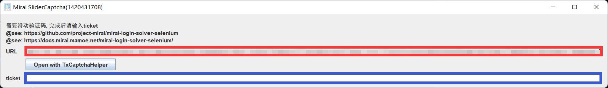
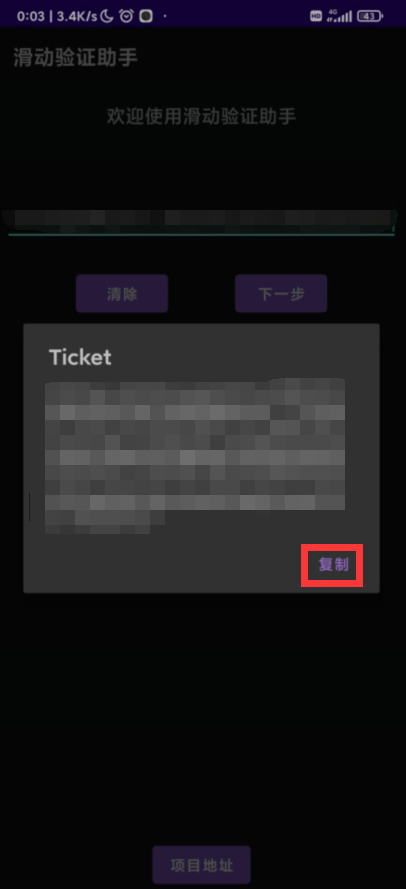
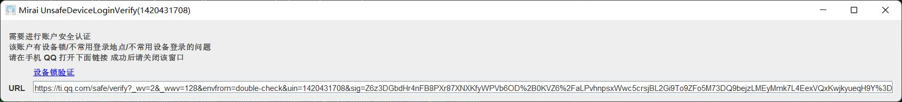
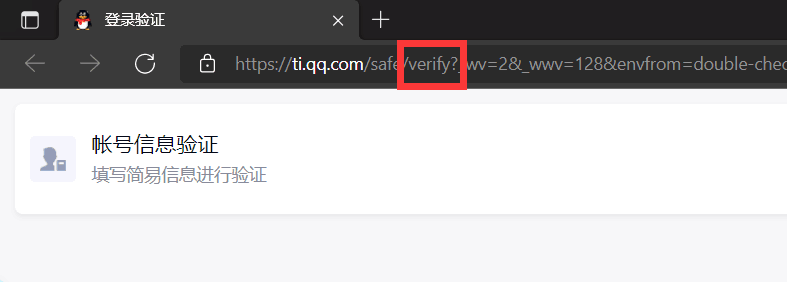
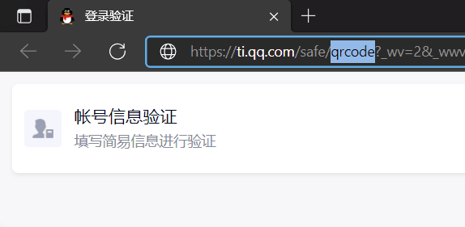
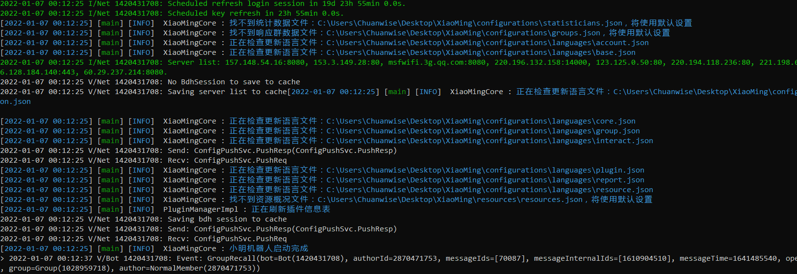
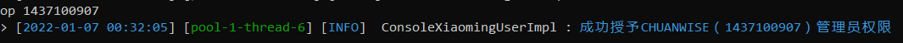
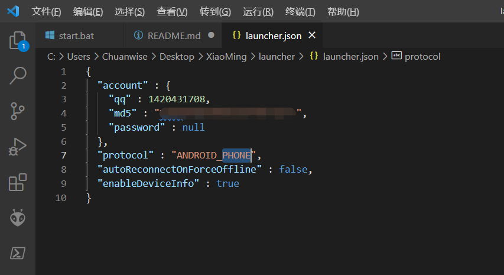
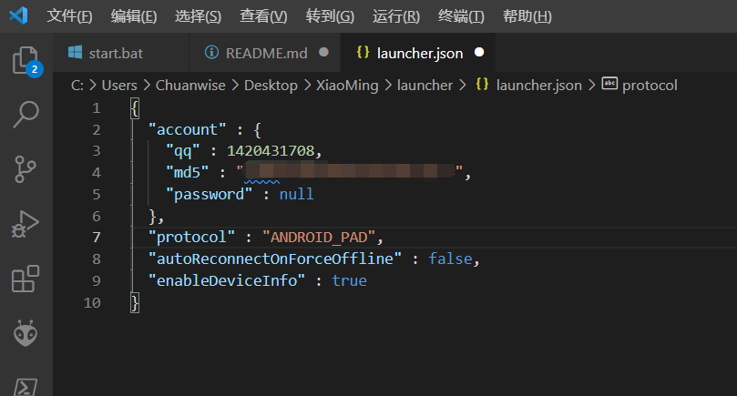

### XiaoMingMinecraft
# 小明 Minecraft 互通插件

本插件是运行在 `Bukkit`、`Spigot`、`Paper`、`Pupur`、`Bungee（即将发布）` 等端的 `Minecraft` 服务器 - `QQ` 互通插件。

项目基于小明 `QQ` 机器人框架 [xiaoming-bot](https://github.com/Chuanwise/xiaoming-bot) 开发，这是一款基于 `Mirai` 的插件化、便于上手、简单小巧的通用 QQ 机器人框架。具有非常简单的上下文交互接口。

除了支持最基础的远程执行指令、绑定查询、互通聊天外，本插件还支持跨区域 @、申请执行指令等功能。

**小明及相关插件的技术交流 / 用户 QQ 群 `小明练剑场`** ：[`1028959718`](https://jq.qq.com/?_wv=1027&k=sjBXo6xh)

## 快速开始
### 启动小明本体：`XiaoMingHost`
小明本体需要 `Java 8` 或更高版本的环境。如果你会开设 `Minecraft` 服务器，相信这对你而言并不是问题。

#### 下载 `XiaoMingHost`
小明本体程序名为 `XiaoMingHost`，你可以在 `小明练剑场` 群文件中下载到最新版。它有两个分支，一个是 `XiaoMingHostGraphical`（带有图形用户界面，即将发布）和 `XiaoMingHostTerminal`（纯控制台界面）。推荐使用控制台版本。

#### 准备小明根目录
准备一个新的空文件夹，作为 `小明根目录`。将你下载好的 `XiaoMingHost` 放入其内。

#### 制作启动脚本
随后创建一个文本文件，取名任意。内容如下：

```bash
java -jar XiaoMingHostTerminal-xxx.jar
pause
```

**务必注意**
1. `-jar XiaoMingHostTerminal-xxx.jar` 是一个整体。你可以继续添加其他的 `JVM` 参数，但**请不要**加到 `-jar` 和 `XiaoMingHostTerminal-xxx.jar` 之间。
1. `java`，`-jar` 和 `XiaoMingHostTerminal-xxx.jar` 三个部分之间至少要有一个空格。
1. **请不要**真的原样复制启动脚本内容。请将文件名修改为你下载到的 `XiaoMingHost` 文件的名字。例如，你下载的是 `XiaoMingHostTerminal-4.3.5.jar`（注意版本号是 `4.3.5`），你应该写 `java -jar XiaoMingHostTerminal-4.3.5.jar`。

对于 `Windows` 用户，请将扩展名修改为 `.bat`，例如 `start.bat`。对于 `Linux` 用户，请将扩展名修改为 `.sh`，例如 `start.sh`。这就是小明本体的启动脚本了。

**结尾建议添加一个 `pause` 暂停，方便查看控制台输出。**


如上图，我在桌面创建了 `XiaoMing` 文件夹作为小明本体文件夹，随后下载了 `4.3.5` 版的 `XiaoMingHostTerminal`，并编写了启动脚本。

#### 初次启动小明
##### 此前未使用过Mirai核心的机器人
对于 `Windows` 用户，请双击启动脚本。对于 `Linux` 用户，请执行 `sh start.sh`，启动小明。

初次启动小明时，你需要输入 `QQ` 和密码。**请仔细阅读屏幕输出**，特别在输入密码时，小明不会显示你输入的密码，**这是一种保护机制，看起来就像是无法输入那样。正常输入密码后回车即可**。

初次启动时**极有可能**需要进行滑块验证。**请不要随便关闭弹框。**

首先，你可能遇到形如下面的滑动验证码弹窗。



如果你使用苹果手机，请寻找使用安卓手机的朋友，按照下面的步骤协助。

如果你使用安卓手机，请在手机上下载 `滑块验证助手`（你可以在 `小明练剑场` 群文件找到，位于 `滑块验证和登陆设备信息采集器` 文件夹下的 `app-release.apk`），将上图中红框中的文本发送到手机上，打开滑块验证助手，将其粘贴到验证码地址输入栏里，随后点击 `下一步`，完成滑块验证后，你将得到一个 `Ticket`：



点击复制以复制该 `Ticket`，将其发送回电脑，并粘贴到弹窗偏下方的输入框中（上上图中蓝色框出），随后**关闭**该弹窗。

接下来你还可能遇到型如下图的扫码验证弹窗。



请点击**蓝色文字**打开扫码验证网页。这个网页极有可能无法加载，就算加载了填写账号信息也是很难过去的，因此我们使用扫码验证。

找到网址中的 `verify`，如下图所示：



将它改为 `qrcode`，如下图所示：



随后确定，就可以打开扫码验证界面。使用登陆了机器人的手机 `QQ` 扫码，通过验证后关闭刚才的扫码验证弹窗即可。

如果继续遇到弹窗，很可能是刚才某一步没有验证成功。弹窗无非两种，扫码验证和滑块验证，按照上面的方法再试即可。

如果一切顺利，你将通过登录安全验证，并启动小明，如下图所示。



当你看到形如 `小明机器人启动完成` 的语句时，恭喜你，你成功启动了 `XiaoMingHost`！后续你可以直接启动，不需要再次进行初次启动的安全验证了。

后续再使用 `Mirai` 核心的 `QQ` 机器人登录该机器人 `QQ` 号时，你可以直接使用小明产生的设备信息，它位于 `小明根目录/launcher/device.json` 下。

##### 此前使用过Mirai核心的机器人
如果你此前使用过 `Mirai` 核心的 `QQ` 机器人插件，可以在小明根目录下创建 `launcher` 并将此前机器人的设备信息 `device.json` 复制到该文件夹下。这样可以避免进行初次登陆的安全验证。

对于 `Windows` 用户，请双击启动脚本。对于 `Linux` 用户，请执行 `sh start.sh`，启动小明。你很有可能不再遇到安全验证，可以直接进行下一步操作。如果你遇到了安全验证之类操作，请按照 [此前使用过Mirai核心的机器人](#此前未使用过Mirai核心的机器人) 的步骤操作。

### 完成基础配置
#### 给自己最高权限
在小明的后台（以后称为 `小明控制台`）输入 `op [你的QQ]`，例如 `op 1437100907`，将自己任命为管理员。

后续你就可以在机器人所在的群聊，或与之的私聊中发送（这样的行为称为 `执行小明指令`）指令了，**无需在控制台执行。**

如果输入时后台有输出信息，则需要重新输入一次，确保指令在完整的一行上，如下图所示。



#### 关闭小明的方式
如果需要关闭小明控制台，**最好**在后台输入 `stop`，**而不是直接关闭（这可能造成一些数据丢失）。**

#### 修改登录协议（可选）
默认情况下，机器人是以安卓手机 `QQ` 用户身份登录的。如果你再使用安卓手机 `QQ` 登录机器人的账号，它将被挤下线。

你可以在关闭小明控制台后 `小明根目录/launcher/launcher.json` 中找到 `protocol`，它的值默认是 `ANDROID_PHONE`，如下图所示：



你可以将它修改为 `ANDROID_PAD`（安卓平板协议），如下图所示：



请务必注意，**不要删除**周围的英文半角双引号 `"`。

`protocol` 控制登录小明的协议，所有取值如下：

|`protocol`|协议|说明|
|----|----|----|
|`ANDROID_PHONE`|安卓手机 `QQ`|是默认的登录方式，具有戳一戳等完整的功能|
|`ANDROID_PAD`|安卓平板|无法发送戳一戳消息|
|`ANDROID_PHONE`|安卓手表|无法发送戳一戳消息|

### 让小明连接服务器
关闭小明后，在小明练剑场群中下载到 `XiaoMingMinecraft` 插件，将它放入 `Bukkit 1.7` 或更高版本的服务器后台（是，你没看错，小明支持 `1.7`）和 `小明根目录/plugins/` 下。随后分别重启或启动 `Minecraft` 服务器和小明。

小明默认占用的端口是 `23333`。如果该端口没有占用，启动小明时你将看到如下输出：

```log
[2022-01-07 00:45:16] [main] [INFO]  PluginManagerImpl : 正在启动插件：XiaoMingMinecraft
[2022-01-07 00:45:16] [nioEventLoopGroup-3-1] [INFO]  XiaoMingMinecraft : 成功在端口 23333 上启动服务器
```

如果此时没有成功在端口 `23333` 上启动服务器，请查看 [修改端口的方式](#修改端口的方式) 中有关修改端口的描述。

#### `Minecraft`服务器和小明在同一台设备上
如果 `Minecraft` 服务器和小明在同一台设备上，小明和服务器初始情况下会自动连接，但小明会拒绝连接。

你将在 `Minecraft` 服务器后台看到如下输出：

```log
[00:46:01] [nioEventLoopGroup-2-1/INFO]: [小明] 成功连接到小明
[00:46:01] [nioEventLoopGroup-2-2/INFO]: [小明] 未成功通过验证，请先私聊小明「迎接新服务器」后使用 /xm connect 再次尝试
```

你将在 `小明控制台` 看到如下输出：

```log
[2022-01-07 00:46:01] [nioEventLoopGroup-3-3] [INFO]  XiaoMingMinecraft : 陌生服务器连接到小明，但因为尚未开启迎新模式，故被拒绝连接
```

请按照提示操作。私聊机器人的 `QQ` 号，发送 `迎接新服务器`，随后在 `Minecraft` 服务器后台输入 `xm connect` 重新连接。你将在后台看到连接验证码，将它发送给小明，并给服务器起一个名字，即可完成初次连接。

> 现在你已经完成初次连接，接下来请阅读 [配置互通频道](#配置互通频道)

#### `Minecraft`服务器和小明不在同一台设备上
如果 `Minecraft` 服务器和小明不在同一台设备上，则数据需要走公网。

请参照 [修改主机的方式](#修改主机的方式) 将 `Minecraft` 那边的 `XiaoMingMinecraft` 要连接主机设置为小明所在的主机地址。

如果小明所在的主机的 `23333` 端口是开放的，并且小明成功在该端口上启动服务器，则不需要修改端口，否则请参照 [修改端口的方式](#修改端口的方式) 修改端口。

随后在 `Minecraft` 服务器上执行 `xm connect` 让小明再次连接。**如果连接失败，请检查防火墙或云主机入出方向规则**。如果连接成功，请参照 [`Minecraft`服务器和小明在同一台设备上](#`Minecraft`服务器和小明在同一台设备上) 的方式继续连接。

> 现在你已经完成初次连接，接下来请阅读 [配置互通频道](#配置互通频道)

#### 修改端口的方式
**除非你知道你正在干什么，否则请勿擅自修改端口**
如果已经成功在现有端口上开启服务器，请先执行小明指令 `关闭服务器`。

随后执行小明指令 `设置服务器端口  [新端口值]`，例如 `设置服务器端口  23334`。随后发送 `关闭服务器` 和 `启动服务器`。小明将在新的端口上开启服务器。

如果小明回复启动失败，则可能是端口被占用，重新设置一个新的端口再次启动服务器即可。

随后请在 `Minecraft` 服务器后台执行 `xm config port [新端口值]`，例如 `xm config port 23334`。

#### 修改主机的方式
**除非你知道你正在干什么，否则请勿擅自修改主机**

请在 `Minecraft` 服务器后台执行 `xm config host [主机地址]`，例如 `xm config port 127.0.0.1`。

### 配置互通频道
#### 快速互通向导
**这个功能还没做完**。做完后，你可以使用某指令打开快速互通向导，帮助你迅速完成常见的频道设置。

#### 自定义互通
自定义互通，你需要了解三个基本组件：

##### 触发器
**触发器是当某些事件发生时会产生消息的组件**。如果你有编程基础，很容易意识到这就是事件监听器。

例如，如果一个触发器在服务器玩家死亡时产生 `哈哈哈哈哈，{player} 死了！` 这样的嘲笑消息，则它是一个**玩家死亡触发器**。

触发器可分成两大类：**QQ 触发器** 和 **服务器触发器**。

目前支持的 **QQ 触发器** 有：群聊消息触发器、私聊消息触发器、群聊禁言触发器。目前支持的 **服务器触发器** 有：玩家上线触发器、玩家下线触发器、玩家聊天触发器、玩家死亡触发器、玩家穿越世界触发器。

触发器可以被安装在 [频道](#频道) 上。

##### 范围
**范围是能发送消息的场所**。显然，范围也有两大类：**QQ 范围** 和 **服务器范围**。

范围的种类不多，目前 **QQ 范围** 只有私聊范围、群聊范围。**服务器范围** 只有全服范围，后续可能增加只包含特定世界、特定玩家的范围。

范围可以被添加在 [频道](#频道) 上。

##### 频道
你可能意识到了，[触发器](#触发器) 用于产生消息，[范围](#范围) 用于发送消息。频道就是一些触发器和一些范围的集合。

值得注意的是，触发器产生的消息只会往另一个区域的范围扩散。例如，`QQ` 触发器产生的消息只会往服务器范围扩散，不会扩散到 `QQ` 范围。服务器触发器产生的消息稚晖往 `QQ` 范围扩散，不会扩散到服务器范围。

当频道的任一触发器被激活产生消息，该消息就会被扩散到该频道所有另一区域的范围。

例如，我有一个服务器 `太学服务器` 和一个群 `太学服务器群`，若想实现双向互通，我创建的频道 `太学频道` 的触发器应该有两个：**玩家聊天触发器** 和 **群聊消息触发器**，范围也应该有两个：**服务器范围** 和 **群聊范围**。

首先执行小明指令 `添加频道  [频道名]`，例如 `添加频道  太学频道`。随后添加触发器。

执行小明指令 `添加群聊消息触发器  [频道名]`：

**群聊消息触发器**

|属性|设置时小明的问题|推荐值|说明|
|---|---|---|---|
|用户标签|哪些 `QQ` 用户能激活该触发器呢？告诉小明他们的标签吧|`all`|`all` 指所有用户|
|群聊标签|哪些群的消息能激活该触发器？告诉小明它们的标签吧|`all`|`all` 指所有群|
|绑定要求|每个 `QQ` 绑定玩家名后才能触发吗？回复我「是」，或其他任意内容|否|大部分情况下都不需要绑定玩家名才能发消息|
|消息过滤类型|哪些消息能激活这个触发器呢？回复我下面的任何一条规则（如「包含」），其他任意内容将使小明允许所有消息触发。开头包含、结尾包含、包含、匹配、开头匹配、结尾匹配、包含匹配、格式匹配|开头包含|我个人比较喜欢开头包含。匹配的意思是正则表达式匹配，而格式匹配还可以提取参数，后文详细描述|
|消息过滤信息|以什么开头呢？|`#`|方便就完事儿|
|权限节点|每个 QQ 需要具备权限才能触发吗？回复我「不需要」或权限节点。|不需要|如有特殊需求可设置。|
|触发器消息|触发器被激活时，将会产生哪些消息？小明建议你将其设置为「§7\[§3{channel}§7\] §b{sender} §8§l: §f{message}」，接受建议请回复「接受」。或者逐条告诉小明你希望触发器激活时产生的消息，使用「结束」结束|接受|如果逐条发送触发器消息，需要最终发送一条 `结束` 代表输入完成。|
|触发器名|为这个触发器起一个名字吧！|（请自行指定）|起一个方便记忆的名字，例如 `群聊消息触发`|

随后执行小明指令 `添加玩家聊天触发器  [频道名]`：

**玩家聊天触发器**

|属性|设置时小明的问题|推荐值|说明|
|---|---|---|---|
|服务器标签|哪些服务器上的人能激活该触发器呢？告诉小明它们的标签吧|`all` 指所有服务器|
|绑定要求|服务器玩家需要绑定 QQ 才能激活该触发器吗？回复「是」，或其他任意内容|否|
|消息过滤类型|哪些消息能激活这个触发器呢？回复我下面的任何一条规则（如「包含」），其他任意内容将使小明允许所有消息触发。开头包含、结尾包含、包含、匹配、开头匹配、结尾匹配、包含匹配、格式匹配|开头包含|**强烈建议和群聊消息触发器设置成一样的**|
|消息过滤器信息|以什么开头呢？|`#`|**强烈建议和群聊消息触发器设置成一样的**|
|触发器消息|触发器被激活时，将会产生哪些消息？小明建议你将其设置为「{player}：{message}」，接受建议请回复「接受」。或者逐条告诉小明你希望触发器激活时产生的消息，使用「结束」结束|接受||
|触发器名|为这个触发器起一个名字吧！|（请自行指定）||

现在频道已经有了两个触发器，接下来再执行小明指令 `添加频道群聊范围  [频道名]  [群聊标签]` 让服务器聊天消息扩散到群里，例如 `添加频道群聊范围  太学频道  1043967360`。

你肯定已经猜到，不管小明问什么标签，其实都可以发 `all` 来指代所有同类事物。例如群聊标签 `all` 指所有群，用户标签 `all` 指所有用户，服务器标签 `all` 指所有服务器等。但**极不建议在此处使用 `all`**，如果这样小明会把服务器的消息发送到所有群里。

`all` 是所有事物自动带有的标签，但同时**每一个群还会自动带有一个群号的标签，服务器还会带有服务器名的标签，用户还会带有一个 `QQ` 号的标签**。因此问标签时，你也可以回答群号、`QQ` 号或服务器名等。

最后执行小明指令 `添加频道服务器范围  [频道名]  [服务器标签]`，让群聊消息扩散到指定的服务器里。


#### 变量系统
你应该注意到了，触发器的消息是可以带有变量的。不同的触发器带来的变量不同。

所有的触发器都带有这些变量：

|变量名|类型|说明|
|---|---|---|
|`channel`|频道名|触发器所在的频道|

摸了，后面再完善。